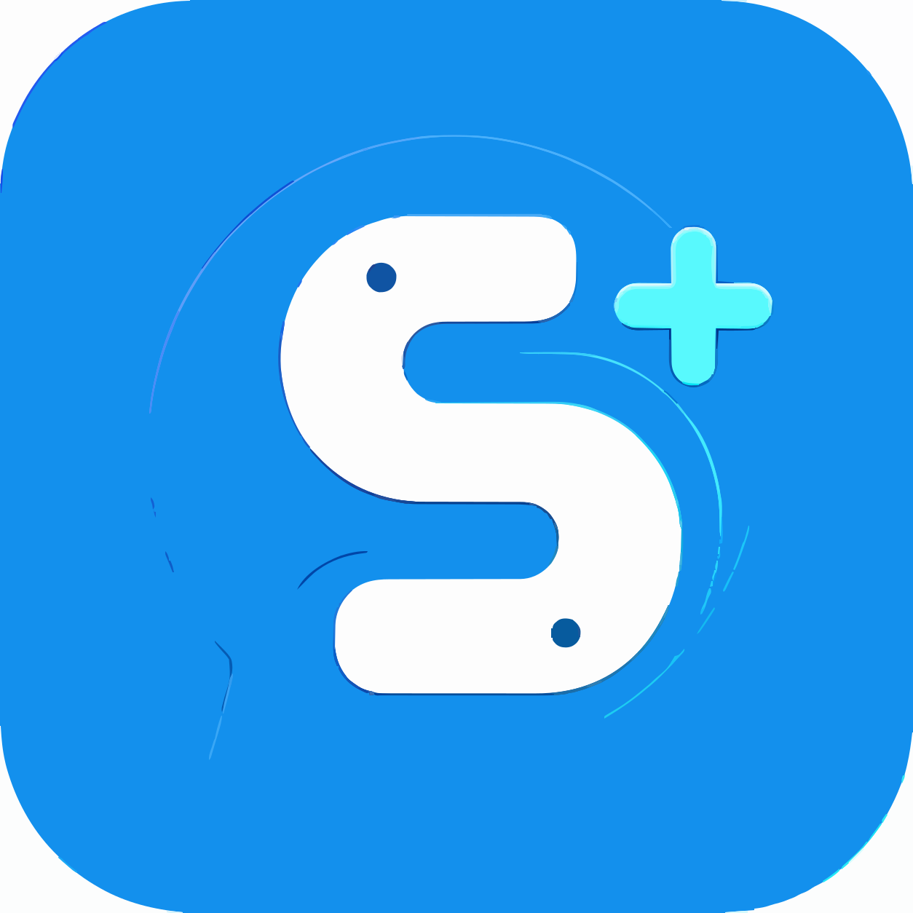

====================
SPlusthon
====================

**SPlusthon** یک کتابخانه asyncio پایتون 3 برای تعامل با API پیام‌رسان
`سروش پلاس <https://web.splus.ir>`_ به عنوان کاربر یا از طریق حساب ربات
(جایگزین API ربات) است.

SPlusthon از فورک Telethon ساخته شده و برای کار با پیام‌رسان سروش پلاس
سازگار شده است. این کتابخانه از اسکیمای TL اختصاصی سروش (لایه 182)،
مسیریابی DC، کلیدهای RSA و انتقال WebSocket استفاده می‌کند.

.. note::

    مانند هر کتابخانه شخص ثالث برای سروش پلاس، در استفاده از این کتابخانه
    مراقب باشید که شرایط استفاده از سروش پلاس را نقض نکنید و در خطر
    مسدود شدن حساب خود قرار نگیرید.

ویژگی‌ها
--------

- تعامل با API سروش پلاس به عنوان کاربر یا ربات
- پشتیبانی از اسکیمای TL اختصاصی سروش (لایه 182)
- مسیریابی DC، کلیدهای RSA و انتقال WebSocket
- پشتیبانی از session (ذخیره و بازیابی نشست)
- پشتیبانی از asyncio و حالت sync
- نیازی به API ID و API Hash اختصاصی نیست

این چیست؟
----------

سروش پلاس یک پیام‌رسان محبوب ایرانی است. این کتابخانه برای سهولت نوشتن
برنامه‌های پایتونی که با سروش پلاس تعامل دارند طراحی شده است. آن را به
عنوان یک بسته‌بندی در نظر بگیرید که کارهای سنگین را برای شما انجام داده
تا بتوانید روی توسعه برنامه خود تمرکز کنید.

نصب
---

.. code-block:: sh

   pip install splusthon

یا از طریق GitHub:

.. code-block:: sh

   pip install git+https://github.com/shayanheidari01/SPlusthon.git

ساخت کلاینت
------------

SPlusthon شامل credentialهای API پیش‌فرض برای سروش پلاس است، بنابراین
می‌توانید بدون نیاز به کلیدهای اختصاصی، کلاینت بسازید:

.. code-block:: python

    from splusthon import SoroushClient, events, sync
    from splusthon.sessions import StringSession

    # نیازی به api_id یا api_hash نیست - مقادیر پیش‌فرض موجود است
    client = SoroushClient(StringSession())
    client.start()

انجام کارها
------------

.. code-block:: python

    # دریافت اطلاعات حساب کاربری
    print(client.get_me().stringify())

    # ارسال پیام متنی
    client.send_message('username', 'سلام! دارم از SPlusthon باهات حرف می‌زنم')

    # ارسال فایل
    client.send_file('username', '/home/myself/Pictures/holidays.jpg')

    # دانلود عکس پروفایل
    client.download_profile_photo('me')

    # دریافت پیام‌ها
    messages = client.get_messages('username')
    messages[0].download_media()

    # گوش دادن به رویدادها
    @client.on(events.NewMessage(pattern='(?i)hi|hello'))
    async def handler(event):
        await event.respond('سلام!')

استفاده از session ذخیره‌شده
------------------------------

اگر رشته session ذخیره‌شده‌ای دارید، می‌توانید آن را بازیابی کنید:

.. code-block:: python

    from splusthon import SoroushClient
    from splusthon.sessions import StringSession

    session_string = '1AwA...'  # از اجرای قبلی
    with SoroushClient(StringSession(session_string)) as client:
        print(client.get_me())

وابستگی‌ها
----------

- ``pyaes`` - رمزنگاری AES
- ``rsa`` - رمزنگاری RSA
- ``aiohttp`` - HTTP async

وابستگی اختیاری:

- ``cryptg`` - شتاب‌دهنده رمزنگاری

لینک‌ها
-------

- GitHub: https://github.com/shayanheidari01/SPlusthon
- سروش پلاس: https://web.splus.ir
- مستندات API: https://tl.splusthon.dev/

مجوز
----

این پروژه تحت مجوز `GNU General Public License v3.0 <LICENSE>`_ منتشر شده است.

ساخته شده توسط `ShayanHeidari <https://github.com/shayanheidari01>`_
